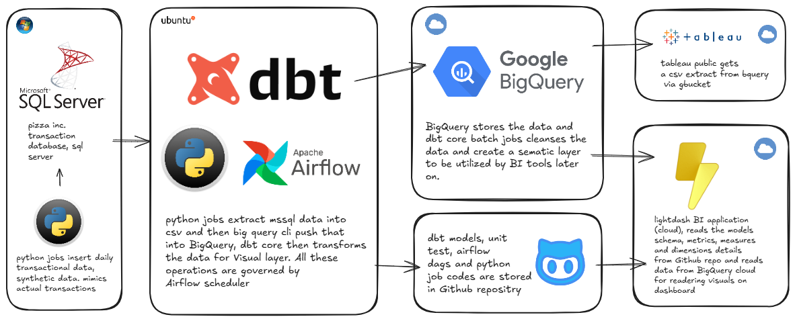
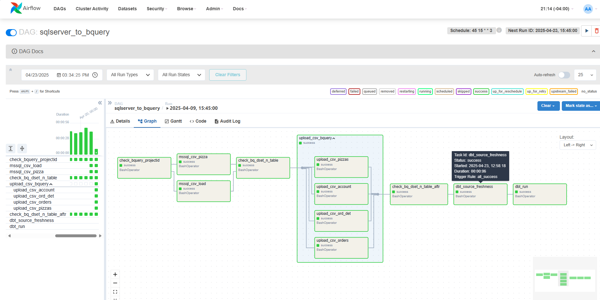
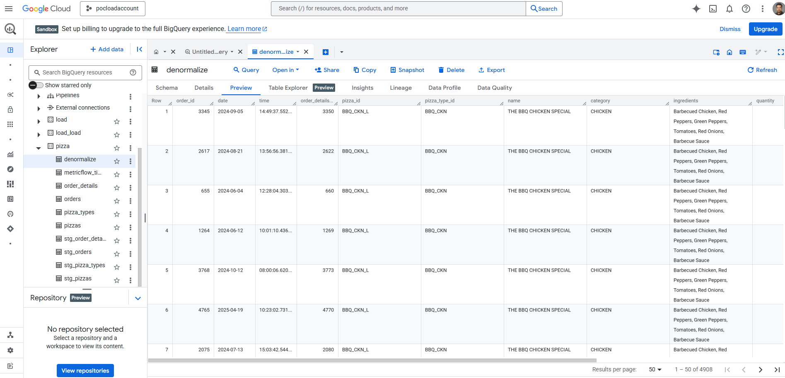

<h2>Google Big Query - Data Platform</h2>
Tech Stack used in this Project
<div style="text-align: center;">
  <table>
    <tr>
      <td align="center"></td>
      <td align="center"></td>
      <td align="center"></td>
      <td align="center"></td>
      <td align="center"><a href="https://console.cloud.google.com/"></td>
      <td align="center"></td>
      <td align="center"><a href="https://app.lightdash.cloud/"></a></td>
      <td align="center"></td>
    </tr>
  </table>
</div>

<h4>Tech Integration Diagram:</h4>


			
<h4>Design Flow:</h4>

```
Data Pipeline
├── Windows Local Machine
│   └── SQL Server Database (Source System)
│       └── Data extracted as CSV
│
├── Ubuntu Server Local Machine
│   ├── Airflow
│   │   └── Schedules and triggers Python Jobs
│   │       └── Python Jobs
│   │           └── Moves SQL Server data as CSV to Ubuntu Server
│   ├── Big Query CLI
│   │   └── Uploads CSV files to Big Query Cloud (Staging Layer)
│   └── DBT Core
│       └── Interacts with Big Query Cloud
│           └── Transforms data and moves to Transformation Layer
│
└── Big Query Cloud
    ├── Bronze: Landing Layer
    │   └── Receives CSV files from Big Query CLI
    ├── Silver : Staging Layer
    │   └── Receives transformed data from DBT Core
    └── Gold: denormalized layer integrated with Lightdash
        └── Creates BI visuals and defines metrics by leveraging schema.yml files from dbt GitHub repository
```

<h4>SNAPSHOTS:</h4>

Airflow - Orchestration



BigQuery - Data Platform



LightDash - Analytics Interface


Reverse Data Push

```
bq extract --destination_format=CSV pizza.denormalize gs://anki_pizza_bucket/denormalize.csv

gsutil cp gs://anki_pizza_bucket/denormalize.csv denormalize.csv
```

lint 

```
sqlfluff lint models/
sqlfluff fix models/
